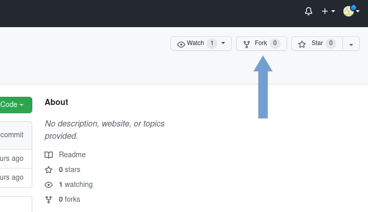
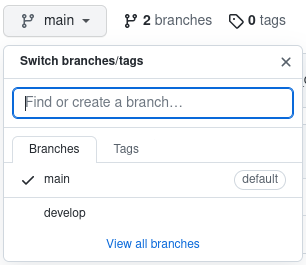
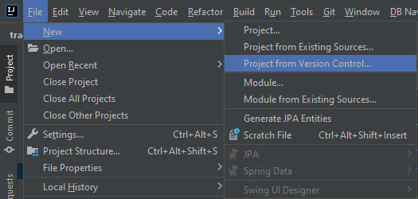
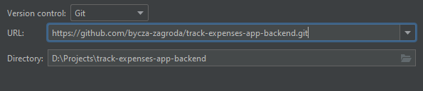
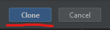
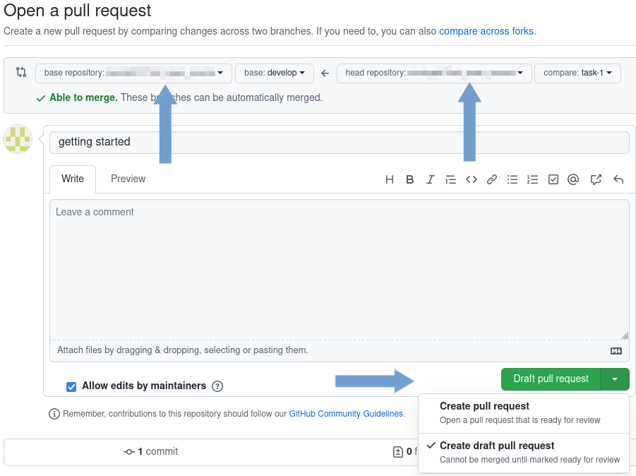

# How we work with GitHub

## Starting work with the task.

1. Go to [our repository](https://github.com/bycza-zagroda/), select backend or frontend and create new fork.



You can leave displayed repository name.

---

2.Expand branches and click link **_View all branches_**.



---

3. Click button **_New branch_** and fill form as below with the name of the branch for your task. Use pattern **_feature/task-name_**, **_bugfix/task-name_**.


Enter a name of new branch and select **_develop_** as a branch source.

## Local repository

1. Clone repository with

### Git

`git clone https://github.com/bycza-zagroda/track-expenses-app-backend.git`

### IntelliJ IDEA





---

2. In local project directory execute commands: (`--allow-empty` allows us to execute commit without any changes in the project)

```shell
git commit -m "getting started" --allow-empty
git push
```

---

3. Back to your repository on GitHub, click **_Pull requests_** and **_New pull request_** button. 


---

4. Select project repository as base repository and **_develop_** as a base branch. 
Head repository should point to your repository and field compare - new created branch.
Click **_Create pull request_** button.


---

5. On the next page make sure that you have correctly set branches (develop in project repository, newly created in yours),
that you selected **_Create draft pull request_** and click on button **_Draft pull request_**.



---

Now you can start working with the task. 

## Code review

Code review can be started from opened draft pull request. You can open it in several ways, below described one of it.
Go to project page and open **_Pull requests_** page. Find yours on the list and open it. Next, click the button **_Ready for review_**. 


## Completing work with the task.

After completing work with the task give an information to the leader that you ask for code review. 
Then Leader assign reviewer for your task and that you are waiting for checking. 
If there is some cases to improve, you need to improve them and give information to your reviewer that you finished. 
Next the leaders check that your changes can be merged to upstream.
