[<ins>English</ins>](GITHUB_WORK.md) - [Polish](GITHUB_WORK.pl.md)

# How we work with GitHub

* [Starting work with the task](#starting-work-with-the-task)
  - [Git](#git)
  - [IntelliJ IDEA](#intellij-idea)
* [Resolving conflicts](#resolving-conflicts)
* [Code Review](#code-review)
* [Completing work with the task](#completing-work-with-the-task)


## Starting work with the task

1. Go to [our repository](https://github.com/bycza-zagroda/track-expenses-app-backend), and select fork.

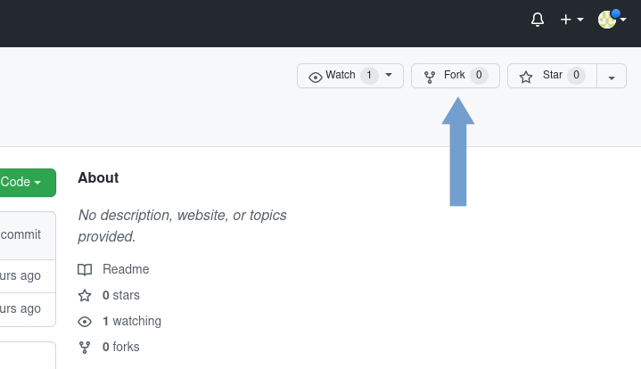

---

2.Expand branches and click link **_View all branches_**.


---

3. Create new branch **_New branch_** and fill form as below with the name of the branch for your task. Use pattern ↓

- **_feature/numberOfIssue-name-Of-Issue_** for new feature. For example: feature/22-Domain-structure-of-money-wallet
- **_bugfix/numberOfIssue-name-Of-Issue_** - for bugfixes. For example: bugfix/22-Domain-structure-of-money-walle

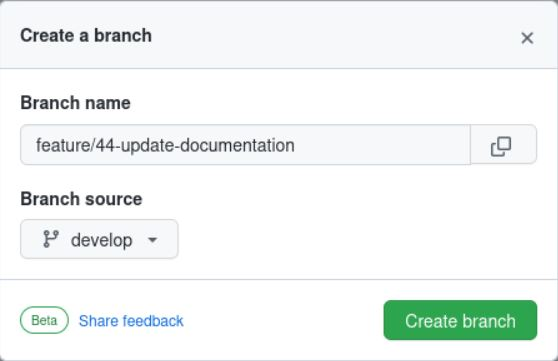

⚠ Make sure you choose **_develop_** as source branch

## Local repository

1. Clone from your fork repository with (in the examples we use the http method)

### Git

`git clone https://github.com/[YOUR-GITHUB-NAME]/[REPOSITORY-NAME].git`

### IntelliJ IDEA

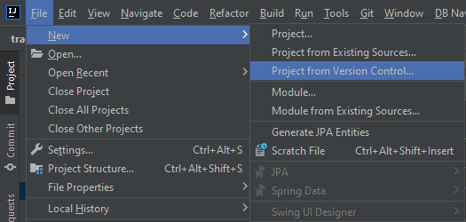

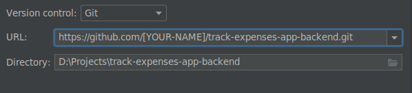

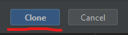

---

2. In local project directory execute commands: (`--allow-empty` allows us to execute commit without any changes in the project)

```shell
git commit -m "getting started" --allow-empty
git push
```

---

3. Back to [your repository on GitHub](https://github.com/bycza-zagroda/track-expenses-app-backend), click **_Pull requests_** and **_New pull request_** button. 


---

4. Select project repository as base repository and **_develop_** as a base branch. 
Head repository should point to your repository and field compare - new created branch.
Click **_Create pull request_** button.

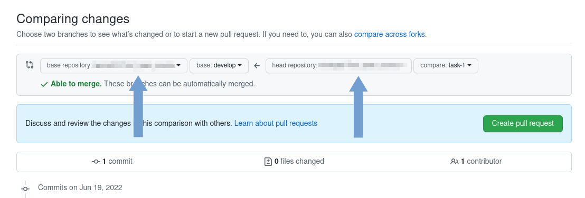

---

5. On the next page make sure that you have correctly set branches (develop in project repository, newly created in yours),
that you selected **_Create draft pull request_** and click on button **_Draft pull request_**.


---

Now you can start working with the task. 

## Commits
Commit should be done according to the image below:
for example for new feature: 

`feat: add new image to the documentation`

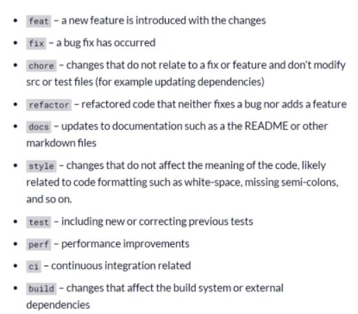


Additionally, If this is code review, commit should start: "code review: message"

## Resolving conflicts
[based on github docs](https://docs.github.com/en/pull-requests/collaborating-with-pull-requests/working-with-forks/syncing-a-fork)

### For developers
Before commit your changes you should resolve conflicts with upstream develop if any.
1. Check that you have set up upstream.
```shell
git remote -v

origin  git@github.com:[YOUR-GITHUB-NAME]/[REPOSITORY-NAME].git (fetch)
origin  git@github.com:[YOUR-GITHUB-NAME]/[REPOSITORY-NAME].git (push)
upstream        https://github.com/bycza-zagroda/[REPOSITORY-NAME].git (fetch)
upstream        https://github.com/bycza-zagroda/[REPOSITORY-NAME].git (push)
```
If you don't see the upstream repository, execute the following command (as `upstream-repository` you should use `track-expenses-app-backend` or `track-expenses-app-frontend`):
```shell
git remote add upstream https://github.com/bycza-zagroda/[REPOSITORY-NAME].git
```
2. Fetch upstream branch.
```shell
git fetch upstream
```
3. Checkout to your fork's develop branch.
```shell
git checkout develop
```
4. Merge upstream/develop into your local develop, next update develop branch in fork repository.
```shell
git merge upstream/develop
git push origin develop
```
5. Checkout to your fork's local branch - in this case, we use `feature/1-feature-name`
```shell
git checkout feature/1-feature-name
```
6. Merge the changes from the `develop` into your local `feature/1-feature-name` branch.
```shell
git merge develop
```
If you don't see any error, you can push your `feature/1-feature-name` branch to your repository.

If there are any existing conflicts, you'll see the following message:
```shell
Aktualizowanie b73c31c..ceeb96d
error: Scalenie nadpisałoby zmiany w następujących plikach:
        MyClass.java
Złóż swoje zmiany lub dodaj do schowka zanim je scalisz.
Przerywanie
```
In this case, you should resolve this conflicts before push your code to your repository. 

#### Resolve conflicts using IntelliJ

In IntelliJ you can see conflict files in Project window are displayed in red. When you open that file, you see which lines needs resolving conflicts.

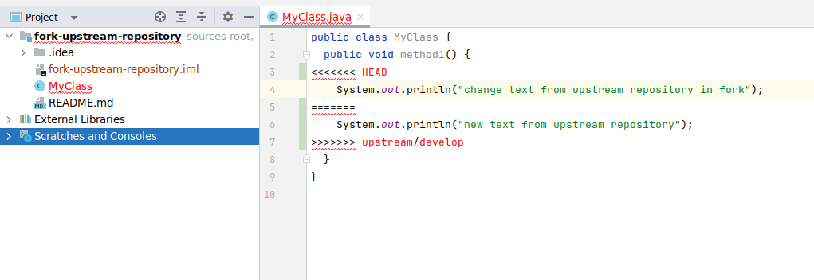

You can use IntelliJ editor to merge this changes and resolve conflicts.

Click the right mouse button on the file with conflict and in menu select Resolve Conflicts
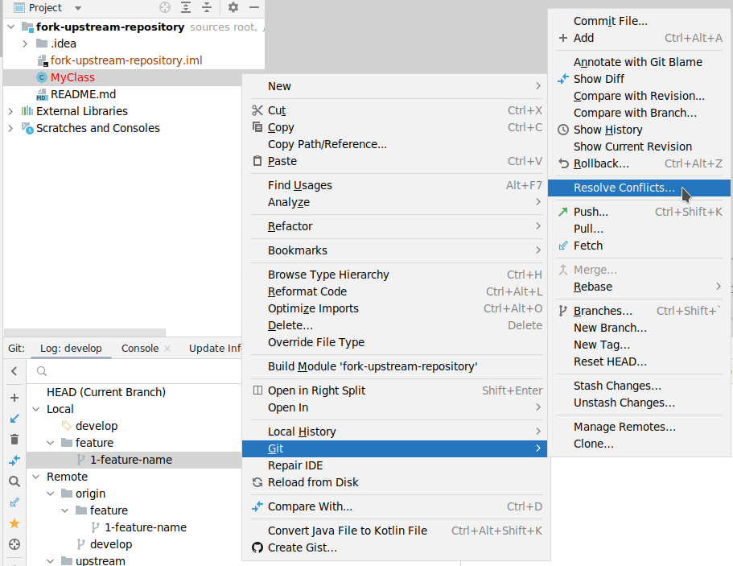

When you click Resolve Conflicts IntelliJ will open Conflicts window

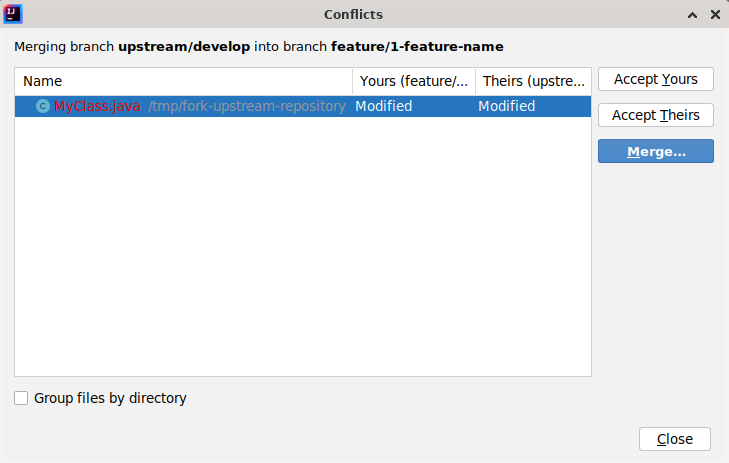

Click Merge button and you see editor

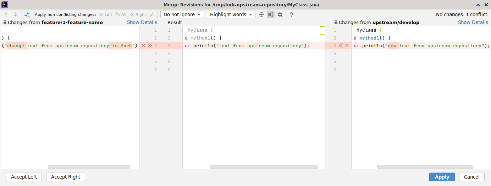

You have three panels here: the left one shows your version of the file, the right one shows the version of the file from upstream.
In the middle you have final version. Decide if you want to keep only your branch's changes, keep only the upstream changes,
or make a brand new change, which may incorporate changes from both branches. 
After resolve all conflict you can click Apply button.

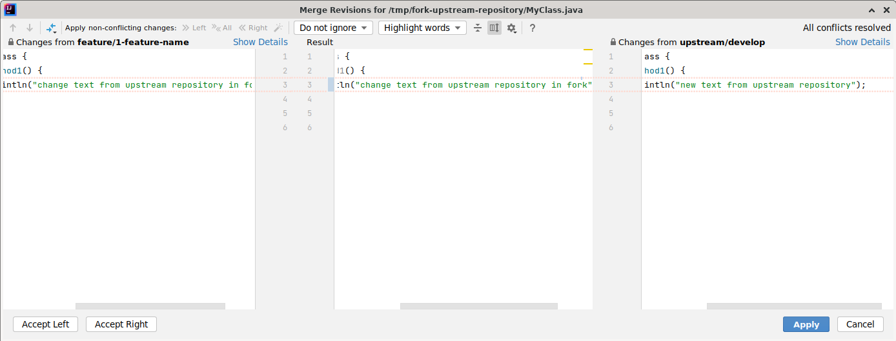

Next commit and push your changes to your fork repo.
```shell
git commit -m "merging with upstream"
git push
```
And you successfully resolve conflicts.

## Code review

Code review can be started from opened draft pull request. You can open it in several ways, below described one of it.
Go to project page and open **_Pull requests_** page. Find yours on the list and open it. Next, click the button **_Ready for review_**. 
 
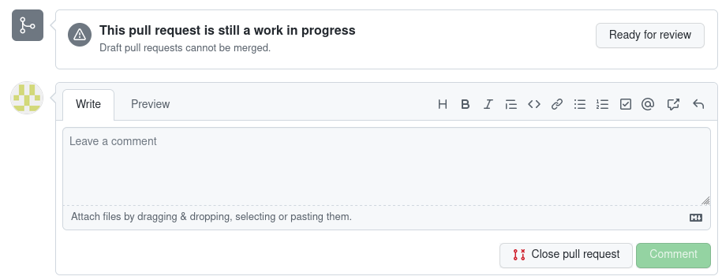

## Completing work with the task

After completing work with the task give an information to the leader that you ask for code review. 
Then Leader assign reviewer for your task and that you are waiting for checking. 
If there is some cases to improve, you need to improve them and give information to your reviewer that you finished. 
Next the leaders check that your changes can be merged to upstream.
